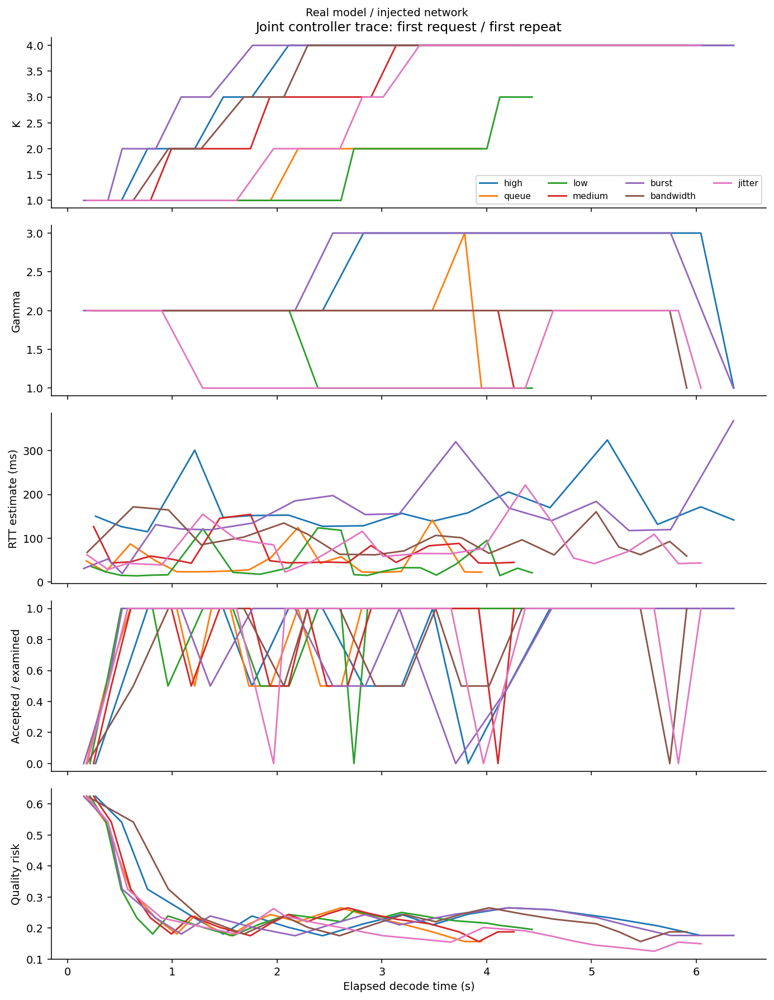
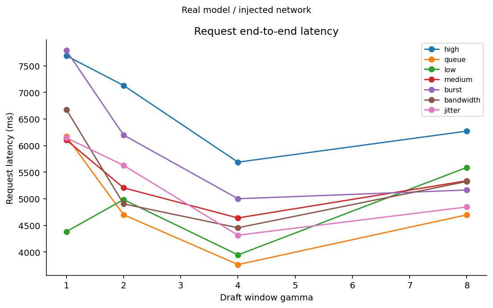
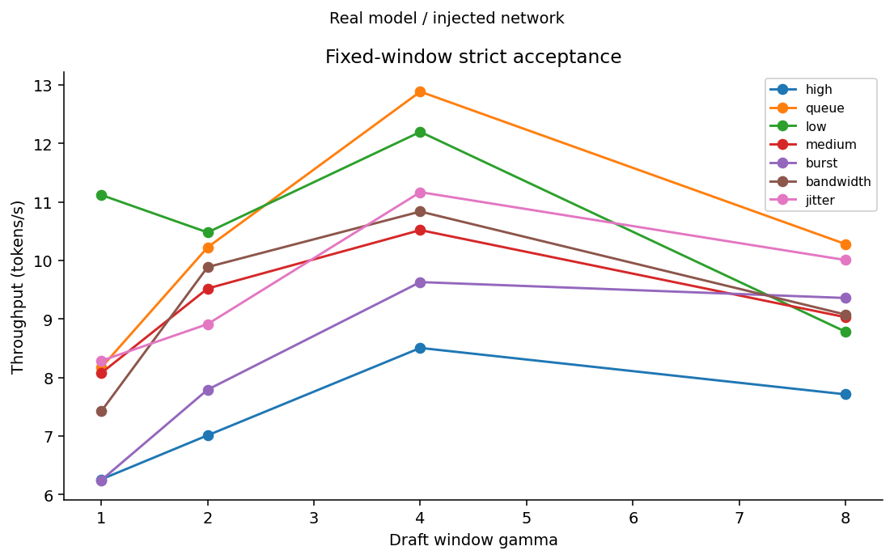
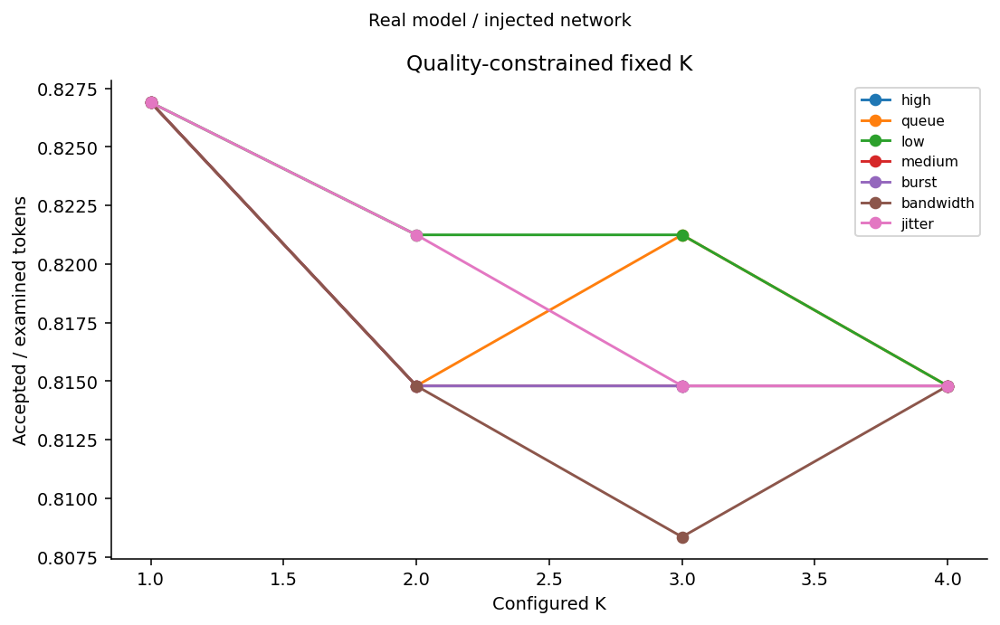
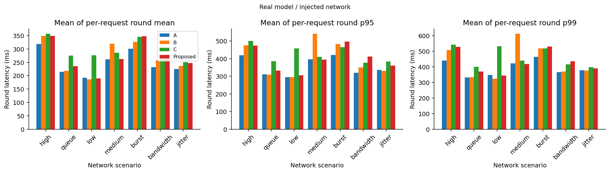
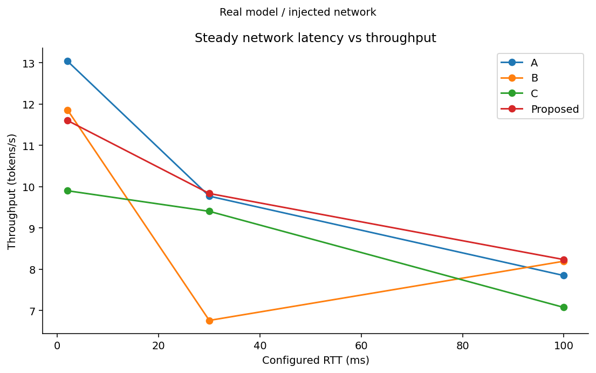
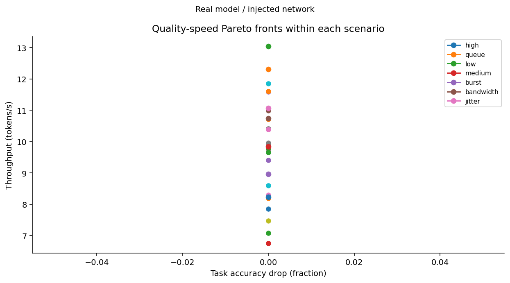
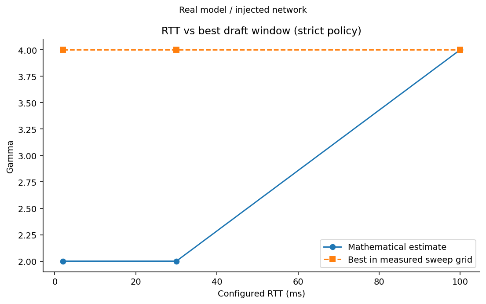
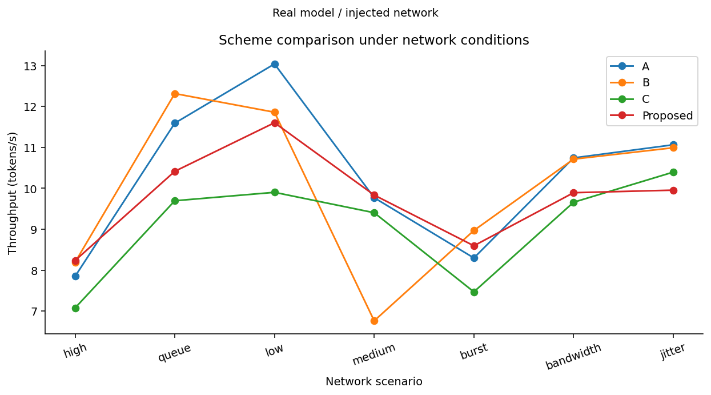
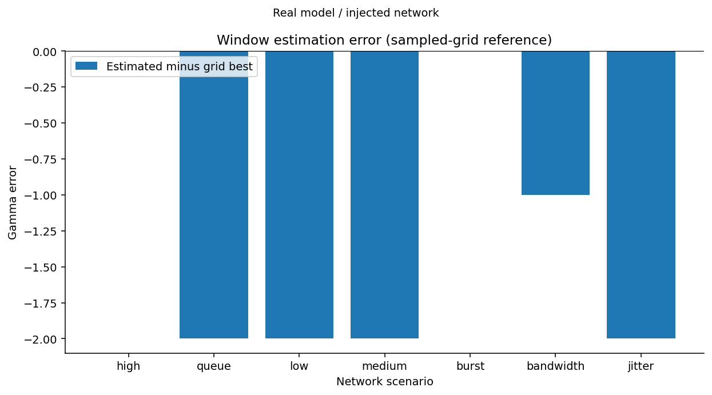

# 云边推测解码实验报告

模式：**real**。真实服务，网络条件为应用层延迟注入；不是操作系统流量整形。

成功请求：672；失败项：0。

基线 A：严格+固定窗口；B：严格+自适应窗口；C：受质量约束的固定 K+固定窗口；Proposed：联合自适应。

质量预算只约束累计 logprob regret，不能保证任务准确率。合成模式 task_quality_drop 为空；使用明确标注的 token 差异率绘图。

每轮原始决策见 ../raw/；请求、轮次、各方案分组统计见 ../tables/；PNG/SVG 见 ../figures/。

TTFT 含模板和分词；TPOT 为验证批次对外可见的 token 时间间隔均值，同批 token 的间隔为零。非流式 API 返回文本的时间不同于这里的首批可用时间。

模拟各方案使用同一合成模型、种子、请求索引、网络函数；重复运行用于管线验证，不代表独立统计样本。真实运行按固定种子打乱方案顺序，但硬件负载与缓存仍需外部控制。

## 检查结果
- static: exit 0
- unit: exit 0
- integration: exit 0

## 失败项
无。

## 基线比较（各请求等权平均）

| 场景 | 方案 | tokens/s | TTFT ms | Token差异率 | 任务质量下降 |
|---|---|---:|---:|---:|---:|
| bandwidth | A | 10.743 | 252.098 | 0.2083 | 0.0000 |
| bandwidth | B | 10.713 | 253.251 | 0.2083 | 0.0000 |
| bandwidth | C | 9.658 | 302.264 | 0.0469 | 0.0000 |
| bandwidth | Proposed | 9.892 | 258.668 | 0.2292 | 0.0000 |
| burst | A | 8.297 | 249.243 | 0.2083 | 0.0000 |
| burst | B | 8.969 | 233.424 | 0.2083 | 0.0000 |
| burst | C | 7.468 | 271.128 | 0.0469 | 0.0000 |
| burst | Proposed | 8.595 | 255.281 | 0.2292 | 0.0000 |
| high | A | 7.848 | 342.337 | 0.2083 | 0.0000 |
| high | B | 8.194 | 287.042 | 0.2083 | 0.0000 |
| high | C | 7.076 | 461.837 | 0.0469 | 0.0000 |
| high | Proposed | 8.234 | 423.974 | 0.2292 | 0.0000 |
| jitter | A | 11.063 | 218.144 | 0.2083 | 0.0000 |
| jitter | B | 10.991 | 278.685 | 0.2083 | 0.0000 |
| jitter | C | 10.395 | 278.480 | 0.0469 | 0.0000 |
| jitter | Proposed | 9.954 | 285.623 | 0.2292 | 0.0000 |
| low | A | 13.040 | 196.482 | 0.2083 | 0.0000 |
| low | B | 11.859 | 214.824 | 0.2083 | 0.0000 |
| low | C | 9.901 | 402.685 | 0.0469 | 0.0000 |
| low | Proposed | 11.602 | 216.421 | 0.2292 | 0.0000 |
| medium | A | 9.770 | 256.697 | 0.2083 | 0.0000 |
| medium | B | 6.761 | 397.853 | 0.2083 | 0.0000 |
| medium | C | 9.403 | 256.104 | 0.0469 | 0.0000 |
| medium | Proposed | 9.835 | 292.895 | 0.2292 | 0.0000 |
| queue | A | 11.592 | 197.607 | 0.2083 | 0.0000 |
| queue | B | 12.315 | 225.460 | 0.2083 | 0.0000 |
| queue | C | 9.695 | 228.040 | 0.0469 | 0.0000 |
| queue | Proposed | 10.415 | 235.520 | 0.2292 | 0.0000 |

模拟中的序列化/反序列化设为零，表示未建模；真实 HTTP 测试与真实服务模式使用 perf_counter 测量。

## 图表

