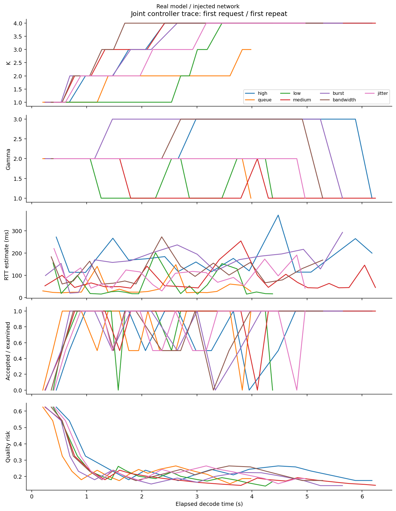
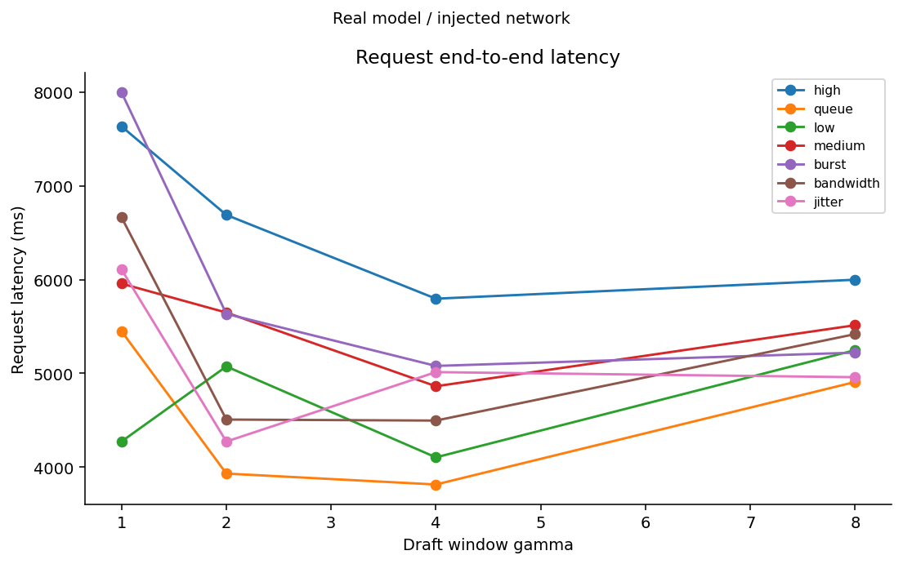
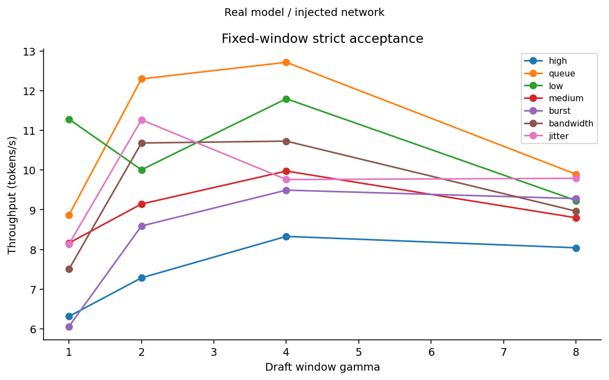
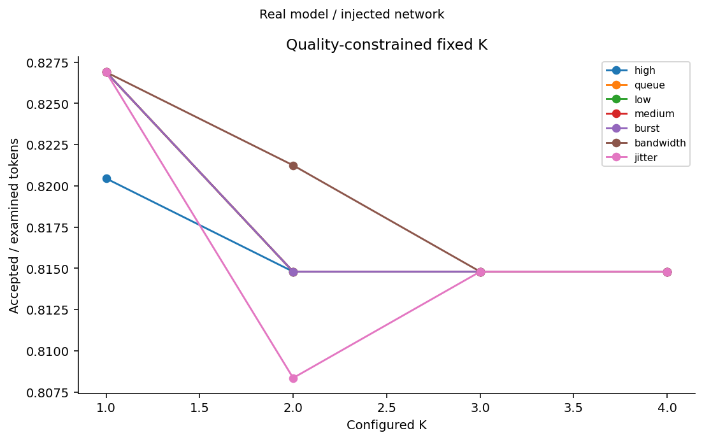
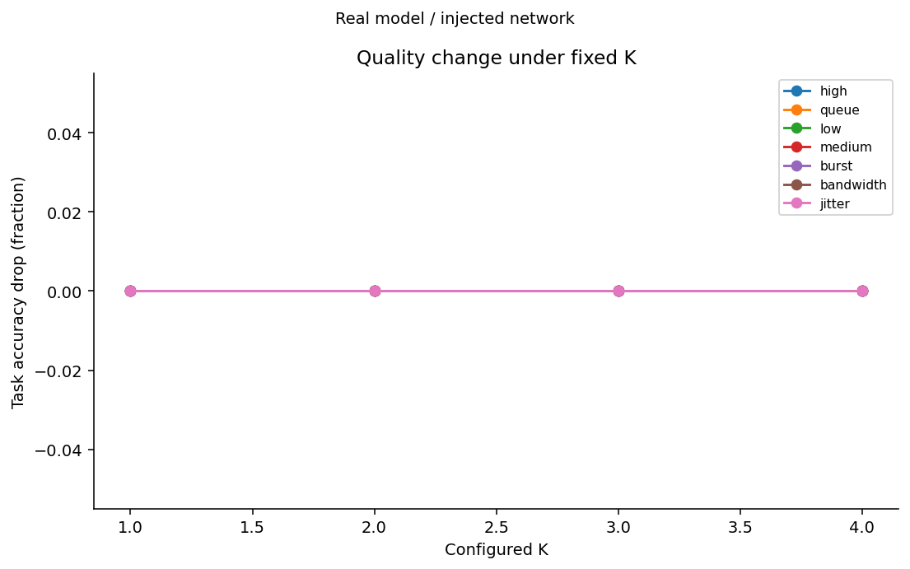
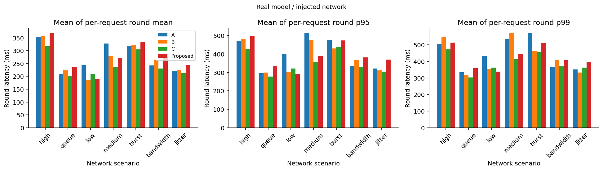
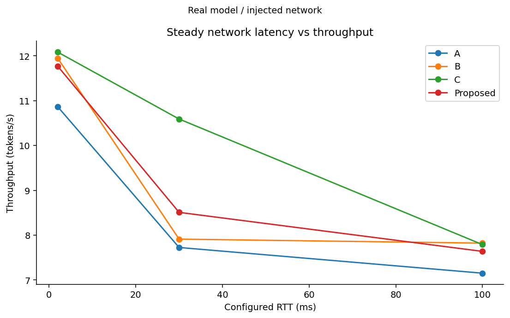
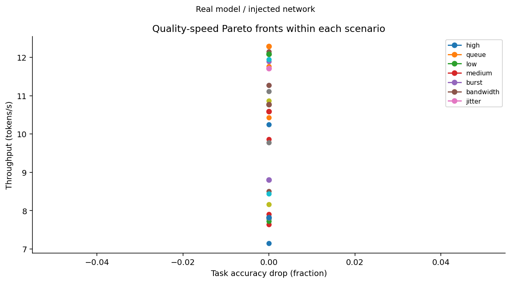
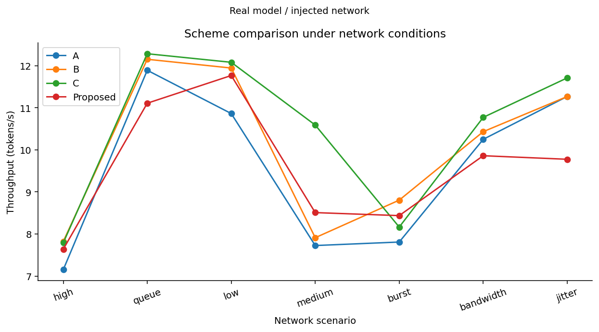
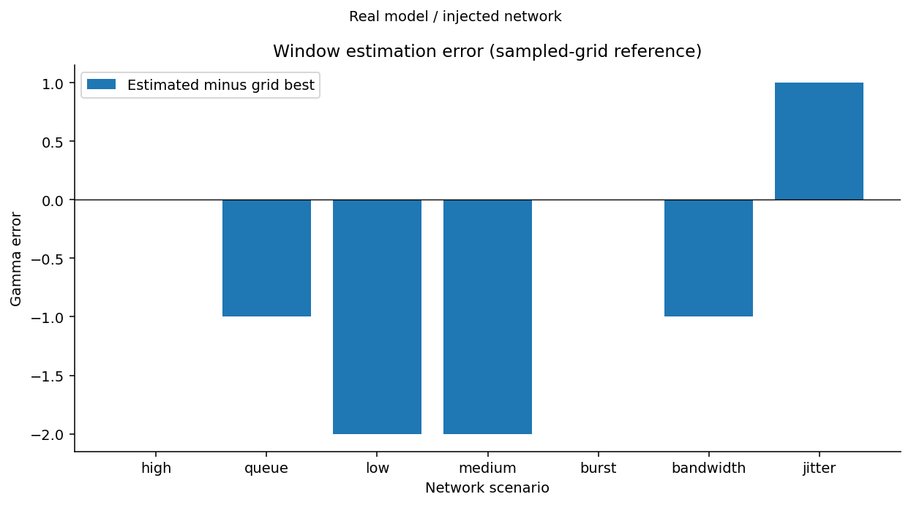

# 云边推测解码实验报告

模式：**real**。真实服务，网络条件为应用层延迟注入；不是操作系统流量整形。

成功请求：672；失败项：0。

基线 A：严格+固定窗口；B：严格+自适应窗口；C：受质量约束的固定 K+固定窗口；Proposed：联合自适应。

质量预算只约束累计 logprob regret，不能保证任务准确率。合成模式 task_quality_drop 为空；使用明确标注的 token 差异率绘图。

每轮原始决策见 ../raw/；请求、轮次、各方案分组统计见 ../tables/；PNG/SVG 见 ../figures/。

TTFT 含模板和分词；TPOT 为验证批次对外可见的 token 时间间隔均值，同批 token 的间隔为零。非流式 API 返回文本的时间不同于这里的首批可用时间。

模拟各方案使用同一合成模型、种子、请求索引、网络函数；重复运行用于管线验证，不代表独立统计样本。真实运行按固定种子打乱方案顺序，但硬件负载与缓存仍需外部控制。

## 检查结果
- static: exit 0
- unit: exit 0
- integration: exit 0

## 失败项
无。

## 基线比较（各请求等权平均）

| 场景 | 方案 | tokens/s | TTFT ms | Token差异率 | 任务质量下降 |
|---|---|---:|---:|---:|---:|
| bandwidth | A | 10.251 | 239.308 | 0.2135 | 0.0000 |
| bandwidth | B | 10.433 | 298.630 | 0.2135 | 0.0000 |
| bandwidth | C | 10.773 | 304.011 | 0.0521 | 0.0000 |
| bandwidth | Proposed | 9.861 | 287.315 | 0.2344 | 0.0000 |
| burst | A | 7.809 | 215.496 | 0.2135 | 0.0000 |
| burst | B | 8.805 | 242.125 | 0.2135 | 0.0000 |
| burst | C | 8.164 | 219.218 | 0.0521 | 0.0000 |
| burst | Proposed | 8.437 | 291.881 | 0.2344 | 0.0000 |
| high | A | 7.152 | 411.497 | 0.2135 | 0.0000 |
| high | B | 7.822 | 379.418 | 0.2135 | 0.0000 |
| high | C | 7.790 | 403.988 | 0.0521 | 0.0000 |
| high | Proposed | 7.638 | 445.666 | 0.2240 | 0.0000 |
| jitter | A | 11.270 | 312.830 | 0.2135 | 0.0000 |
| jitter | B | 11.268 | 283.674 | 0.2135 | 0.0000 |
| jitter | C | 11.711 | 353.865 | 0.0521 | 0.0000 |
| jitter | Proposed | 9.776 | 302.772 | 0.2240 | 0.0000 |
| low | A | 10.864 | 365.297 | 0.2135 | 0.0000 |
| low | B | 11.946 | 242.764 | 0.2240 | 0.0000 |
| low | C | 12.082 | 254.947 | 0.0521 | 0.0000 |
| low | Proposed | 11.768 | 265.582 | 0.2240 | 0.0000 |
| medium | A | 7.726 | 411.426 | 0.2135 | 0.0000 |
| medium | B | 7.912 | 460.712 | 0.2135 | 0.0000 |
| medium | C | 10.590 | 315.212 | 0.0417 | 0.0000 |
| medium | Proposed | 8.509 | 322.654 | 0.2344 | 0.0000 |
| queue | A | 11.893 | 313.956 | 0.2135 | 0.0000 |
| queue | B | 12.154 | 219.148 | 0.2135 | 0.0000 |
| queue | C | 12.286 | 221.676 | 0.0521 | 0.0000 |
| queue | Proposed | 11.109 | 217.062 | 0.2344 | 0.0000 |

模拟中的序列化/反序列化设为零，表示未建模；真实 HTTP 测试与真实服务模式使用 perf_counter 测量。

## 图表

